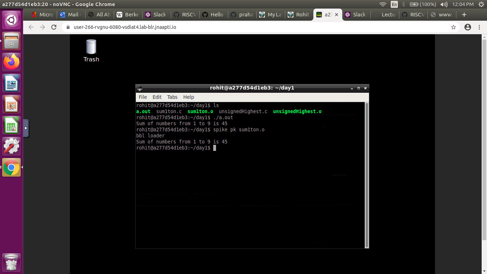
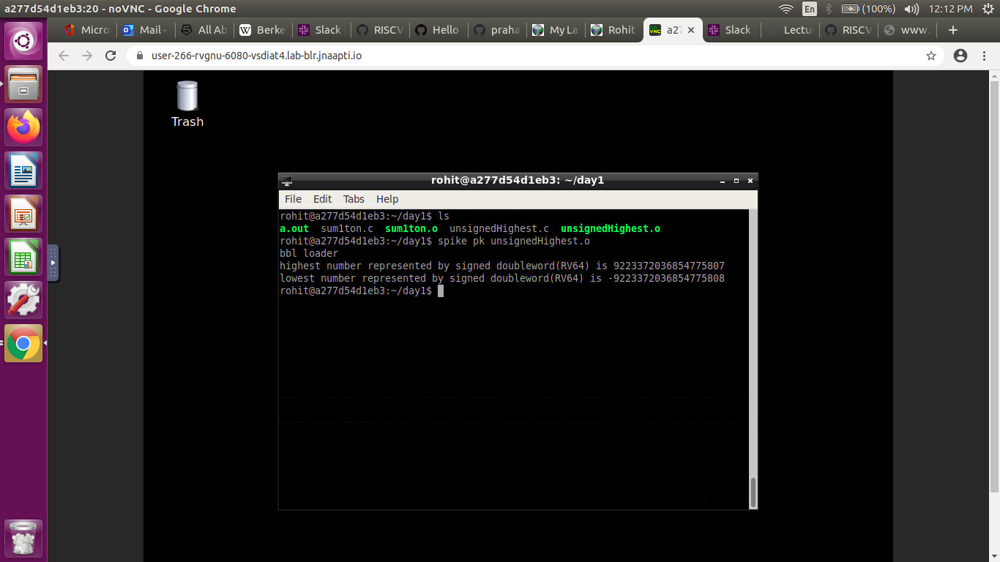
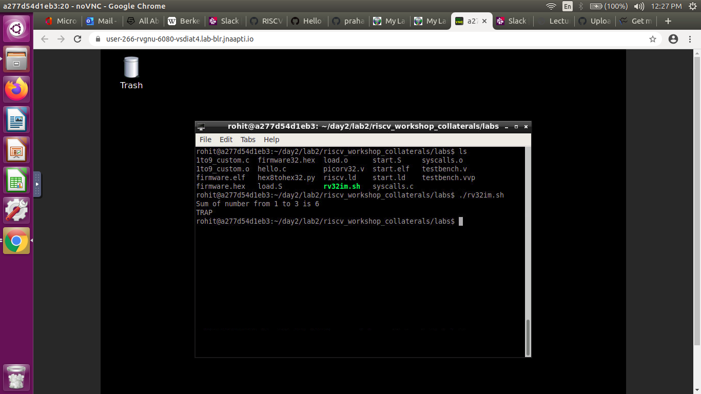
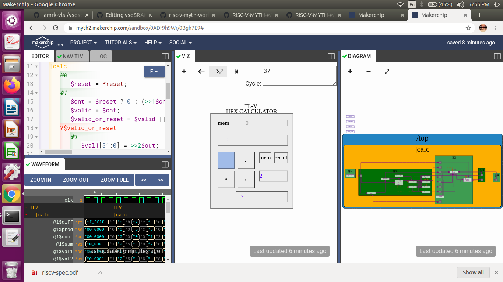
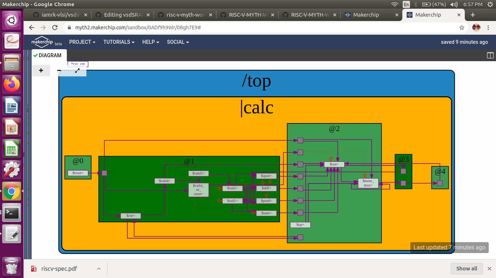
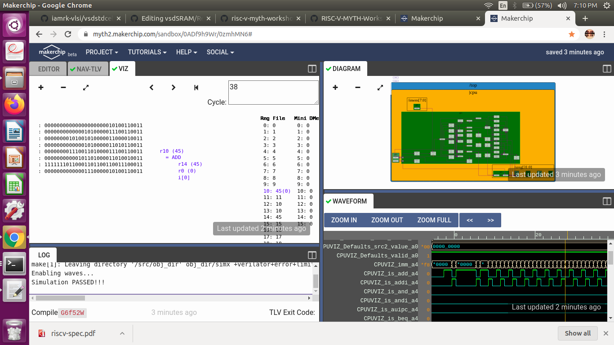
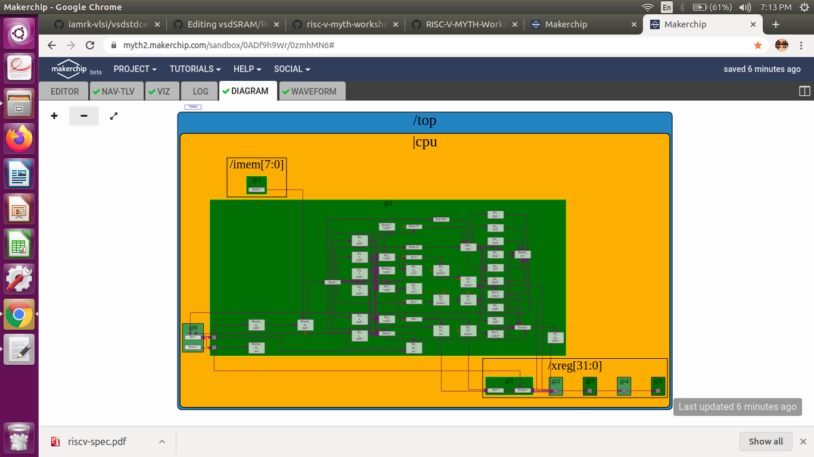
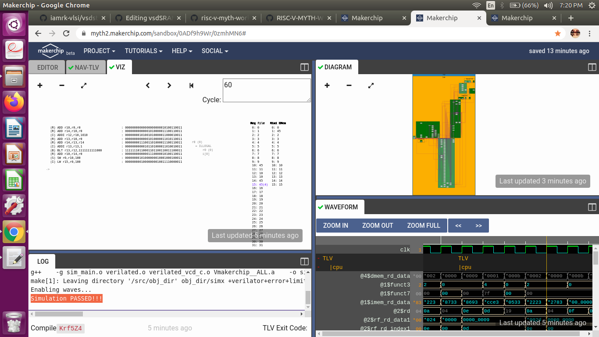
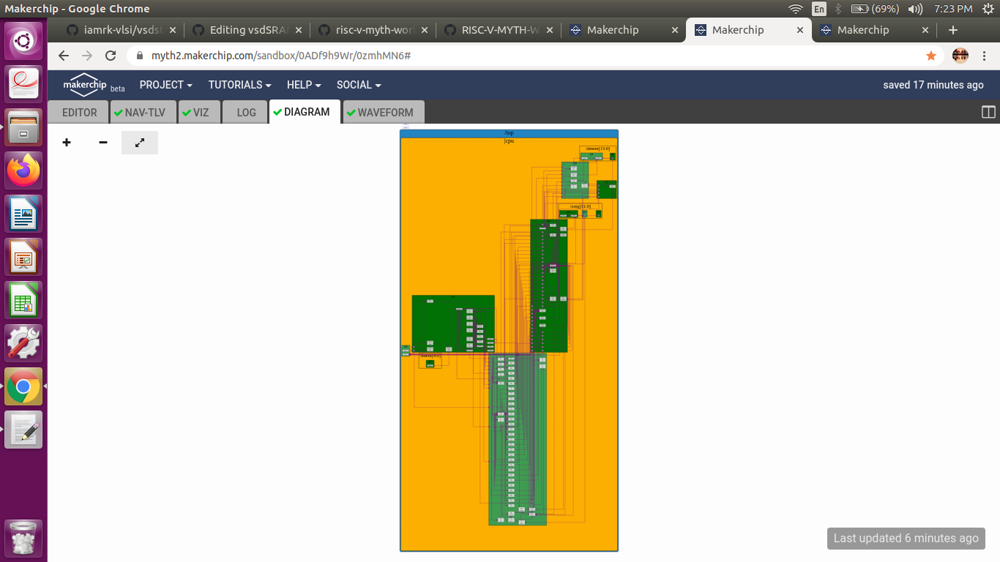

# How I built a RISC-V CPU Core in a span of 5 days
My Project Repository for RISC-V MYTH ( Microprocessor for You in Thirty Hours) workshop, conducted by VSD Corp and Redwood EDA.This workshop was conducted over a period of 5 days and in  this short span of time we were able to understand & implement a RISC-V core with base instruction set. Programming language used in the software section was C, assembly (pseudo codes) were also utilised, along with [TL-Verilog](https://tl-x.org/) for HDL implementation. Tools used: Spike and [Makerchip IDE](https://www.makerchip.com/).

# Table of Contents
- [What is RISC V?](#What-is-RISC-V?)
- [Day 1 Instruction Set Architecture & GNU Toolchain.](#Day-1-Instruction-Set-Architecture-&-GNU-Toolchain)
- [Day 2 Application Binary Interface and basic verification flow.](#Day-2-Application-Binary-Interface-and-basic-verification-flow)
- [Day 3 Introduction to TL Verilog and Makerchip.](#Day-3-Introduction-to-TL-Verilog-and-Makerchip)
- [Day 4 RISCV CPU Core Implementation.](#Day-4-RISCV-CPU-Core-Implementation) 
- [Day 5 Pipelining the RISCV Core.](#Day-5-Pipelining-the-RISCV-Core)
- [Acknowledgements.](#Acknowledgements)

# What is RISC V?
RISC-V is an open source instruction set architecture(ISA) based on reduced instruction set computing concept.Unlike other existing commercial ISAs, the RISC-V ISA is open and this makes it easy and flexible for anyone to build a processor that supports it. In this workshop we were given the overview of the software as well as the hardware aspect and hands on labs were done to learn by doing rather than just reading the theory or specifications.

# Day 1 Instruction Set Architecture & GNU Toolchain.
  This was just a warm up of the extensive work we would be doing in the further days. It made us familiar with the VSD-IAT platform and using the lab instances . 
  A brief overview of how the higher level languages are converted to assembly and then into machine/binary format , in a hierarchical level was given. Then we     were introduced to the various types of instructions which are as follows:
  
  - **RV64I** or RV32I Base integer instructions: 64 and 32 bit data instructions respectively
  - **RV64M** i.e Multiply extension
  - **RV64IM** : Includes base and multiple extension.
  - **RV64F** and **RV64D** : Floating point and Double extenstion. 
  
  Additionally we learnt about the integer number representation and their maximum and minimum ranges.
  
  - Integer: 
    - Word i.e. 32 bits.
    - Double word i.e 64 bits
    - RV64 has range 0 to (264 - 1)
    
  - Negative i.e signed numbers:
    - Range is - 263 to (263 - 1)
    
    The instructions which work on these numbers are called Base Integer Instruction **RV64I**.
  
## Lab 1 : C program of Sum 1 to n  numbers.
  A basic C program to calculate sum of natural numbers upto a limit provided by the user. The code can be found [here](https://github.com/iamrk-vlsi/RISC-V-MYTH-Workshop/tree/master/DAY1/sum1to9.c) 
  - Command used to compile the C program is `gcc <filename.c>` or `gcc -o <binary file name> <filename.c>`and to run we use `./a.out` or `./<binary file name>` 

## Lab 2 : C program of Sum 1 to n  numbers, RISC-V toolchain.
  The same C program is now compiled using RISC-V toolchain. 
  - Command used to compile the C program is `riscv64-unknown-elf-gcc -O1 -mabi=lp64 -march=rv64i -o sum1ton.o sum1ton.c` or 
    `riscv64-unknown-elf-gcc -Ofast -mabi=lp64 -march=rv64i -o sum1ton.o sum1ton.c`.
  - To view to disassemble and view the object file in readable format,we use `riscv64-unknown-elf-objdump -d sum1ton.o` command.
  - To run we use spike which is a RISC-V simulator, following is the command `spike pk sum1ton.o`.
  - Spike has a debugging feature too which can be used to run it in steps, following is the command `spike -d pk sum1ton.o`.
  
  **Output on console**
  

## Lab 3 : Max and Min number representations. 
  A C program is implemented to  show the maximum and minimum sizes for RV64I. The code can be found [here](https://github.com/iamrk-vlsi/RISC-V-MYTH-Workshop/tree/master/DAY1/unsignedHighest.c) 
  - Commands used are same as Lab 2

  **Output on console**
  
  
# Day 2 Application Binary Interface and basic verification flow.
  On This day, we delved deep into the lower layers on how the higher layer instructions in c are translated to machine understandable codes. 
  Just like how application program interface (API) is used by application programs to access the standard libraries, an application binary interface or system     call interface is utilised hardware resources . The ISA is inherently divided into two parts: *User & System ISA* and *User ISA*  the latter is available to the   user directly by system calls. 
  
  Now, how does the ABI access the hardware resources? 
  - It uses different registers(32 in number) which are each of width `XLEN = 32 bit` for RV32 (~`XLEN = 64 for RV64`) . On a higher level of abstraction these       registers are accessed by their respective ABI names.
  
  For base integer instructions there are broadly 3 types of of such registers:
  - I-type : For instructions having immediate values as operands.
  - R-type : For instructions having only registers as operands.
  - S-type : For instructions used for storing operations.
  
## Lab 1 : ASM & ABI function Calls
  A new program is made by modifying the original `sum1ton.c` and adding ASM and ABI function call .The code can be found [here](https://github.com/iamrk-vlsi/RISC-V-MYTH-Workshop/tree/master/DAY2/Day2_lab1)
  - Command used to compile the program is `riscv64-unknown-elf-gcc -Ofast -mabi=lp64 -march=rv64i -o 1to9_custom.o 1to9_custom.c load.S`. 
  - To view to disassemble and view the object file in readable format, we use `riscv64-unknown-elf-objdump -d 1to9_custom.o|less`.
  - To run we use spike which is a RISC-V simulator, following is the command `spike pk 1to9_custom.o`.
  
  **Output on console**

## Lab 2 : To run and verify on a RISC-V Core
  An RTL implementation of a RISC-V core has been provided to us and we run the above program using the scripts provided to using iverilog simulator, just to observe  the behaviour of the program in hardware. A similar core would be implemented by us in the forthcoming days.
  
  **Output on console**
  
  
# Day 3 Introduction to TL Verilog and Makerchip. 
  An introduction to TL-Verilog was done and we implemented basic combinational and sequential logic using the same.This day finally ended with an implementation of a sequential cyclic calculator. Makerchip IDE which is an open source tool developed by Redwood EDA was utilised.
  
  TL-Verilog is an extension for System Verilog, moreover it acts as an higher level abstraction for System verilog which makes HDL implementation very easy and error free. Here we deal the design at a transaction level assuming the design as a pipeline, where inputs would be provided and output will be generated at the end of the pipeline. 
  
  **Advantages** : 
   - Code reduction , and thus less chances of being bug prone.
   - In pipelining ,the flip flops,registers and other staged signals are implied from the context. 
   - It is very easy to stage different sections without impacting the behaviour of the logic.
   - Validity feature which provides easier debugging, cleaner design, automated clock gating and better error checking capabilities.
    
  ## Lab: 1 Cycle Sequential Calculator with Validity
   There were exaustive number of labs for each and every lesson and it indeed was a hectic day, but the end result was an implementation of a fully working 1 cycle sequential calculator, which was built step by step as we progressed through the lessons.The code can be found [here](https://github.com/iamrk-vlsi/RISC-V-MYTH-Workshop/tree/master/DAY3/cyclic_calc.tlv).

   **Makerchip IDE** 
   

   **Note** As seen above, apart from the waveforms, The VIZ graphic visualizer was a very helpful tool in Makerchip which helped us analyse and debug our design in case of any functional errors.
  
   **1 Cycle Calculator with Validity**
    	
   Overall this was a hectic day, as it took time for me to learn and implement these new concepts, as well as get used to the tools.The   final of Day-3 forms the basis for ALU of the RISC-V core.
   
# Day 4 RISCV CPU Core Implementation.
  Due to the strong basics built in TL-Verilog and digital design in the previous day , The core aspect of this workshop to build a RISC V core went smoothly for   me. On this day , a plan was implemented to build the following :
  
  - Program Counter (PC)
  - Imem-Rd ( Instruction Memory)
  - Instruction Decoder
  - Register File Read
  - Arithmatic Logic Unit (ALU)
  - Register File Write
  - Branch
  
  Thus the instruction set architecture of base integer instructions, The register file, branching,etc. and eventually the CPU core was built and tested(using appropriate testbench logic, and assembly code developed on Day 2) at the end of the day ,in similar progressive fashion like the previous day.The code can be found [here](https://github.com/iamrk-vlsi/RISC-V-MYTH-Workshop/tree/master/DAY4/MP_1_cycle.tlv).

   **Makerchip IDE**
   

   **RISC-V CORE**
   	

# Day 5 Pipelining the RISCV Core.
   Finally,we developed the pipelined model for the core developed on Day 4. 
   - A 3 cycle RISC V pipelined core, with all the base integer instruction sets was developed. 
   - For Load and store a Data memory element was added with neccessary instruction decoding logic.
   - Register Bypass and Squashing techniques were also incorporated to prevent `Read followed by write`
     and `branching`hazards, arised due to pipelining.
   - Testing of the pipeline design was done in same manner with Load and store incorporated in asm code.
   - Additionally Incorporation of Jump feature (JAL and JALR instructions) was also done.The code can be found [here](https://github.com/iamrk-vlsi/RISC-V-MYTH-Workshop/tree/master/DAY5/RISC_V_CORE.tlv).
   
   **Makerchip IDE**
   

   **Final RISC V CPU Core**
   

# Acknowledgements
- [Kunal Ghosh](https://github.com/kunalg123), Co-founder (VSD Corp. Pvt. Ltd)
- [Steve Hoover](https://github.com/stevehoover), Founder, Redwood EDA.
- [Shivam Potdar](https://github.com/shivampotdar), CPU Architecture/Performance Modeling Engineer,AMD.
- [Vineet Jain](https://github.com/vineetjain07),RISCV Community member, GSoC Student,FOSSi Foundation.
